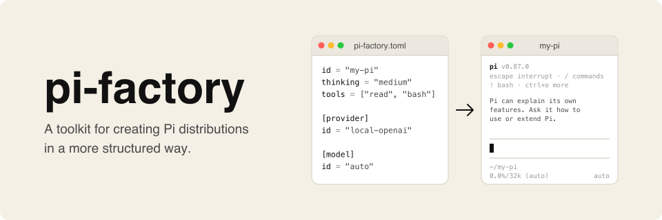

# pi-factory

<p align="center">
  
</p>

pi-factory is a toolkit for creating Pi distributions.

A Pi distribution is a named build of [Pi](https://pi.dev) with its own model
setup and extensions. It keeps its state and sessions apart from your main Pi
setup, while everything else, from the TUI to the extension SDK, stays standard
Pi. You describe a distribution in one `pi-factory.toml` manifest, and
pi-factory validates that app bundle and launches Pi with the right config.

## Examples

[localpi](https://github.com/osolmaz/localpi) is a Pi distribution for testing
small local models on constrained systems. It finds the running llama.cpp, vLLM,
or LM Studio server and points Pi at the loaded model.

[Pi Reviewer](https://github.com/osolmaz/pi-reviewer) reviews a Git diff in a
fresh Pi process and returns findings ranked from P0 to P3, in the same shape as
`codex review`. Its manifest is
[`pi-factory.toml`](https://github.com/osolmaz/pi-reviewer/blob/main/pi-factory.toml).

[diffusionpi](https://github.com/osolmaz/diffusionpi) runs Pi against a local
vLLM server with DiffusionGemma and draws the model's answer live in the TUI
while it denoises. Its manifest is
[`app/pi-factory.toml`](https://github.com/osolmaz/diffusionpi/blob/main/app/pi-factory.toml).

## Install

From npm:

```bash
npm install -g @osolmaz/pi-factory
```

During development:

```bash
npm install
npm run build
node dist/src/cli/main.js --help
```

## Create an App Bundle

```bash
pi-factory init my-app
```

That creates:

```text
my-app/
  pi-factory.toml
  prompts/system.md
  extensions/
```

Minimal `pi-factory.toml`:

```toml
id = "my-app"
name = "My App"
version = "0.1.0"
schema_version = 1
state_dir = "~/.local/state/my-app"
pi_command = ["npx", "-y", "@earendil-works/pi-coding-agent@latest"]
thinking = "medium"
tools = ["read", "bash"]
system_prompt = "prompts/system.md"

[provider]
id = "local-openai"
base_url = "http://127.0.0.1:1234/v1"
api = "openai-completions"

[model]
id = "auto"
context_window = 32768
max_tokens = 8192
reasoning = false
```

To use a provider and model from Pi's built-in catalog, reference the provider instead of redefining it:

```toml
[provider]
id = "openai-codex"
source = "pi"

[model]
id = "gpt-5.6-terra"
reasoning = true

[inherit]
providers = ["openai-codex"]
```

pi-factory uses the selected provider implementation, models, and authentication from the user's
main Pi profile. The app still selects its own provider and model, and pi-factory does not write that
selection back to normal Pi. Credentials stay in their existing store.

Package resources are also explicit:

```toml
[[inherit.packages]]
source = "example-package"
extensions = ["extensions/example.ts"]
skills = ["skills/example/SKILL.md"]
prompt_templates = ["prompts/example.md"]
themes = ["themes/example.json"]
```

Missing lists inherit nothing. pi-factory disables ambient resource and context discovery, then adds
only app-owned and selected paths.

Add Pi extensions with normal Pi extension files:

```toml
[[extensions]]
path = "extensions/demo.ts"
append_system_prompt = "prompts/demo.md"
```

Paths are relative to the app bundle root unless absolute. `pi_command` is an argv array, not a shell string. Prefix bundle-relative command paths with `./`, put environment values in `[env]`, and use a script file when shell behavior is needed.

## Run

Inspect the resolved launch without starting Pi:

```bash
pi-factory plan --app-dir ./my-app
```

Validate a bundle:

```bash
pi-factory validate ./my-app
```

Launch Pi through the app bundle:

```bash
pi-factory run --app-dir ./my-app
```

Repository-focused apps can keep their bundle files separate from the working
directory used by Pi:

```bash
pi-factory run my-app --cwd /path/to/repository
```

The launch writes Pi-compatible runtime config under the app state directory,
then starts the configured Pi command with environment variables such as
`PI_CODING_AGENT_DIR` and `PI_CODING_AGENT_SESSION_DIR`. Bundle resources still
resolve from the app root when `--cwd` selects another directory.

## Link and Install Apps

For local app bundles:

```bash
pi-factory link /path/to/my-app
pi-factory run my-app
```

For GitHub-hosted bundles:

```bash
pi-factory install owner/repo[/subdir...] --ref main --yes
pi-factory run my-app
```

There is no central registry. The app name comes from the installed bundle's
manifest `id`.

## Commands

```text
pi-factory init <app-id> [dir]
pi-factory validate <app-id|app-dir|app-file>
pi-factory plan <app-id>|--app-dir <dir>|--app-file <file>
pi-factory run <app-id>|--app-dir <dir>|--app-file <file>
pi-factory inspect <app-id>|--app-dir <dir>|--app-file <file>
pi-factory link <app-dir>
pi-factory install <owner>/<repo>[/subdir...] [--ref REF] [--yes]
pi-factory uninstall <app-id>
pi-factory list
```

## JavaScript API

```ts
import {
  createPiCommandPlan,
  createPiLaunchPlan,
  createPiFactoryRuntime,
  loadPiApp,
  manifestToDefinition,
  runPiApp,
  runPiCommand,
  writePiRuntimeConfig
} from "@osolmaz/pi-factory";
```

Use the API when another launcher wants pi-factory's app resolution and config generation but owns
its own process. `createPiLaunchPlan` and `runPiApp` accept launch overrides for a target `cwd`, Pi
run mode, provider, model, thinking level, ephemeral or named sessions, and initial messages.

`createPiFactoryRuntime` gives SDK apps the same explicit provider and package selection. It returns
the selected `ModelRuntime`, model, restricted `DefaultResourceLoader`, and one `run` boundary for
the complete high-level operation. The app's model choice is private to that runtime.

The old broad `profile: "ambient"` override is removed. Use `[inherit]` to name the exact provider
and package resources the app needs.

## Web Mode

[`@osolmaz/pi-factory-web`](packages/web) runs an app in the browser: a session list on the left
and the app's Pi TUI on the right, in a ghostty-web terminal. It takes the same app definition as
`runPiApp`:

```ts
import { runPiWebApp } from "@osolmaz/pi-factory-web";

process.exitCode = await runPiWebApp(app);
```

It is a separate package, so apps that never use the browser do not install it. See
[packages/web/README.md](packages/web/README.md).

## More

- [Specification](docs/spec.md)
- [Manifest reference](docs/manifest-v1.md)
- [Selective profile inheritance plan](docs/2026-08-21-selective-profile-inheritance-plan.md)

## License

[MIT](LICENSE)
